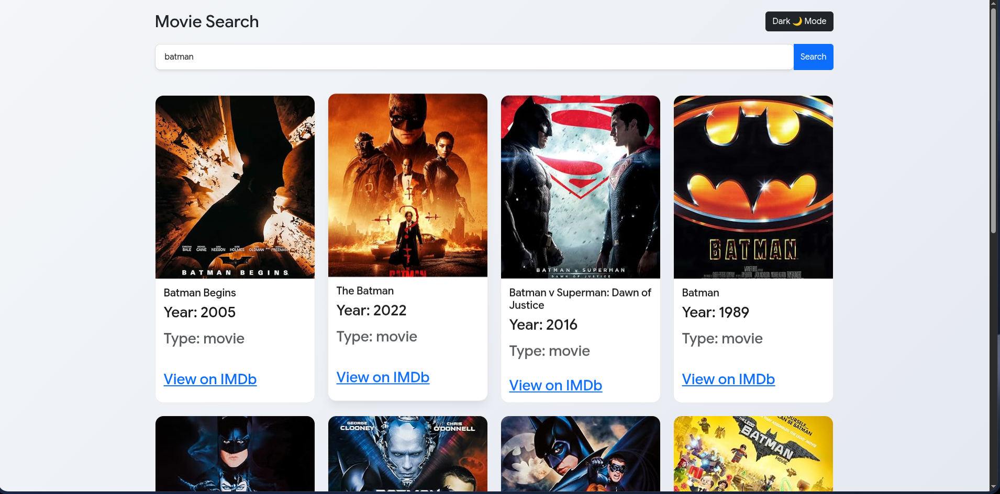

# Movie Search Dashboard

A sleek, responsive movie exploration web application built with React and styled using React-Bootstrap. This project features an interactive movie search engine powered by the OMDb API and includes a fully custom, persistent Light/Dark theme engine.

## 🚀 Live Demo

[👉 Click here to view the Live Demo 👈](YOUR_LIVE_DEMO_LINK_HERE)


---

## ✨ Features

* **Dynamic Movie Search:** Real-time search processing utilizing data fetched asynchronously from the OMDb API.
* **Custom Theme Engine:** Built a native React Context (`ThemeContext`) to handle global Dark and Light modes seamlessly.
* **Persistent Preferences:** User theme selections are cached via `localStorage` so your preference is remembered on page reload.
* **Fluid Responsive UI:** Leverages React-Bootstrap's grid systems coupled with advanced CSS aspect-ratio properties to ensure card images look incredibly sharp on all screen breakpoints (mobile, tablet, desktop).
* **Micro-interactions:** Smooth CSS transitions for theme morphing and cinematic card elevation/scaling on hover states.

---

## 🛠️ Tech Stack

* **Frontend Library:** React (Functional Components & Hooks)
* **Styling & UI Components:** React-Bootstrap & Custom CSS3 Variables
* **Data Fetching:** Fetch API (Async/Await architecture)
* **Build Tool:** Vite
* **Data Source:** OMDb (Open Movie Database) API

---

## 📂 Project Structure

```bash
movie-app/
├── public/
├── src/
│   ├── assets/
│   ├── context/
│   │   └── ThemeContext.jsx
│   ├── pages/
│   │   └── Home.jsx
│   ├── App.css
│   ├── App.jsx
│   ├── index.css
│   └── main.jsx
├── .gitignore
├── eslint.config.js
├── index.html
├── package.json
├── package-lock.json
├── README.md
└── vite.config.js
```

## 📸 Screenshots

### Light Mode



### Dark mode


### Tablet 


### Phone 


## 📦 Installation & Setup

Follow these steps to run the project locally on your machine:

1. **Clone the repository:**
```Bash
   git clone https://github.com/mrxcyb3r/Movie-app.git
```
2. **Navigate into the project directory:**
```Bash
cd Movie-app
```

3. **Install the dependencies:**
```Bash
npm install
```

4. **Start the local development server:**
```
Bash
npm run dev
```

5. **Open your browser and navigate to http://localhost:5173 to see the app running!**

___

# 🚀 Future Improvements
***
Movie Details Page

Favorites/Watchlist Feature

Search History

Infinite Scrolling

Movie Ratings & Reviews

Trending Movies Section
***
🤝 Contributing

Contributions, issues, and feature requests are welcome.

Feel free to fork the repository and submit a pull request.

📄 License

This project is licensed under the MIT License.

👨‍💻 Author

Elshodbek Muxtorov

GitHub: https://github.com/mrxcyb3r